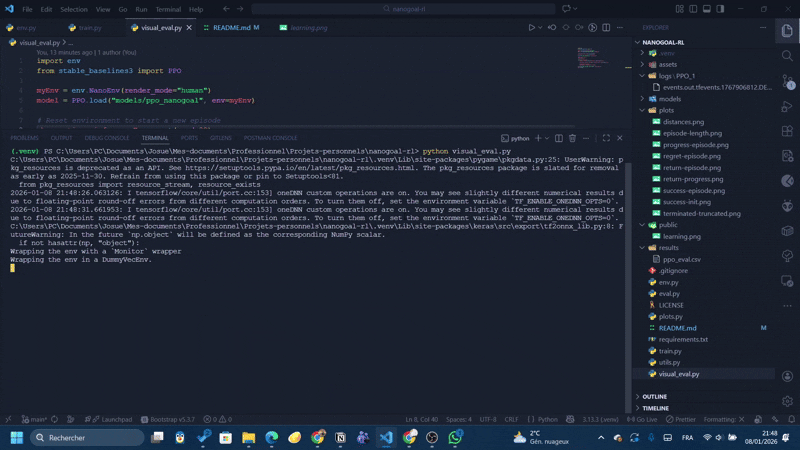
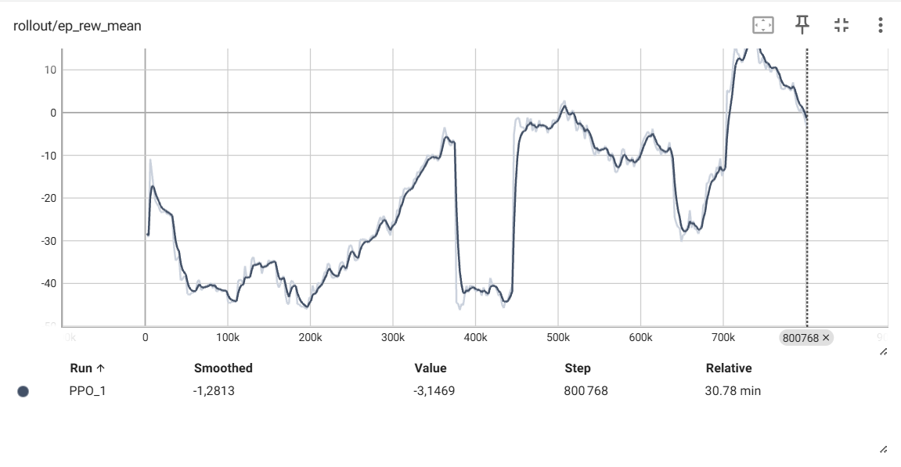
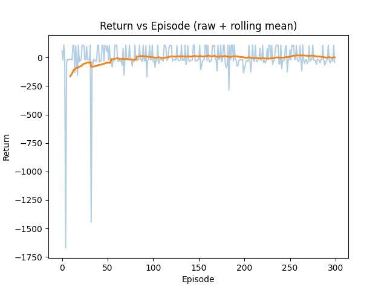
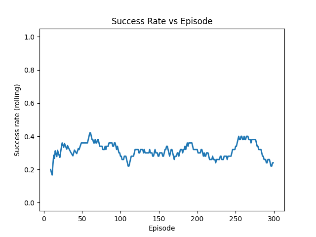
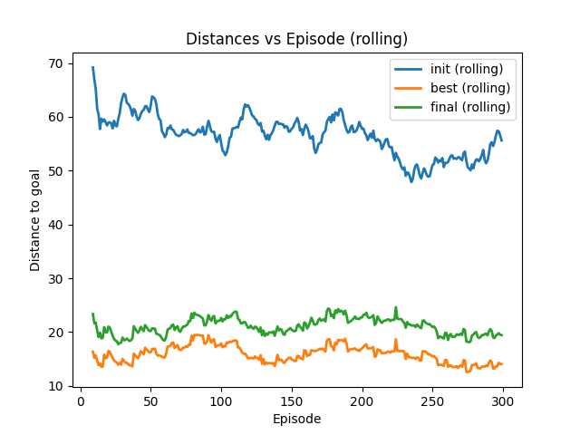
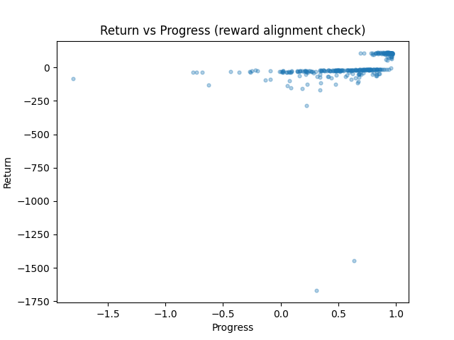
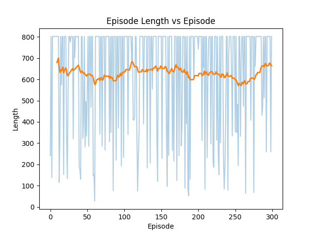

# An example of the agent's behavior


# Training the model
<p align="center">
  <br>
  <u><em>Evolution of reward during learning episodes</em></u>
</p>

# Testing the trained model over 300 episodes

<p align="center">
  <br>
  <u><em>Evolution of reward during testing episodes</em></u>
</p>

<br />

<p align="center">
  <br>
  <u><em>Success rate during episodes</em></u>
</p>

<br />

<p align="center">
  <br>
  <u><em>The relationship initial distance to goal, best distance during episode and final distance at the end</em></u>
</p>

<br />

<p align="center">
  <br>
  <u><em>The relationship between the reward and the actual progress</em></u>
</p>

<br />

<p align="center">
  <br>
  <u><em>Behavior of the length of episodes</em></u>
</p>


# NanoGoal-RL

NanoGoal-RL is a goal-conditioned reinforcement learning project where a simulated 2D nanorobot learns to autonomously reach multiple target positions in a continuous environment while avoiding obstacles. The project focuses on decision-making, trajectory optimization, and control using modern reinforcement learning methods.

## Motivation

Controlling robots at very small scales is challenging due to limited sensing, noisy dynamics, and constrained actuation. NanoGoal-RL explores how goal-conditioned reinforcement learning can be used to learn flexible control policies that generalize across many objectives, which is a key requirement for future nano-robotic systems.

## Project Overview

The project simulates a nanorobot moving in a 2D continuous space. At each episode, a target position is randomly generated. The agent receives both its current state and the goal as input and must learn a policy capable of reaching any target efficiently.

Key ideas explored:
- Goal-conditioned reinforcement learning
- Continuous control
- Autonomous decision-making
- Simulation-based robotics

## Environment

- Observation space: they are mostly normalized to make learning more easy
  - Robot position `(x, y)`
  - Distance to goal `(x_delta_goal, y_delta_goal)`
  - Velocity and orientation relative to the $x$-axis `(v, theta)`
  - Distance to walls in 8 directions from agent
- Action space:
  - Changes to the orientation `dtheta`
  - Variation to the velocity `dv`
- Reward:
  - Negative changes in the velocity and orientation to prevent the agent from spining too much and encourage it to keep a more direct trajectory
  - Touching the white or red cells generated at random places and moving in the blood like liquid gives a penalty (greater penalty for white cells)
  - Positive reward when the agent reduces the distance between it and the goal
  - Positive reward when the goal is reached
  - Negative reward when truncated or the agent goes out of the blood vessel's boundaries (out of the window)
- Episode termination:
  - Goal reached
  - Nanorobot out of the bounds of the environment
  - Maximum number of steps exceeded

## Methods

The agent is trained using Proximal Policy Optimization (PPO).

The implementation relies on standard RL libraries to ensure reproducibility and clarity.

## Technologies Used

- Python
- NumPy
- Gymnasium
- Stable-Baselines3
- PyTorch
- TensorBoard
- Tensorflow
- Matplotlib
- Pandas

## Results

After training the agent for 800 000 timesteps, it is able to reduce the distance between it and the target and maintain a continuous trajectory. In some cases it is even able to attain the target and go around walls.
But it still needs fine tuning because it isn't able to do very well in all cases and even though it sometimes can achieve the goal, it makes too many useless moves (go round in circles for some time before starting to make progress).
Performance is evaluated through trajectory visualization and reward analysis.

Based on the result, the insufficient performance observed is likely due to the complexity and diversity of the environments generated during learning which makes the learning process unstable. It might be best to make the agent learn gradually
starting with easy episodes and going to more complex ones.

## Installation

```bash
git clone https://github.com/your-username/NanoGoal-RL.git
cd NanoGoal-RL
python -m venv venv
source venv/bin/activate
pip install -r requirements.txt
```

## Usage

Train the agent:
```bash
python train.py
```
NB: You might want to change the number of timesteps in other to not lose too much time.

Vizualize the learning statistics:

```bash
python -m tensorboard.main --logdir logs
```

Test a trained model on 300 episodes:
```bash
python eval.py
```
The results will appear as a CSV file in the 

Launch an episode with visual rendering with the trained agent:
```bash
python visual_eval.py
```

Vizualize trajectories concerning the performances for the 300 test episodes:
```bash
python plots.py
```

## Future work

- Improve the reward logic in the environnement so that the agent can attain most of the targets
- Include progressive curriculum for the training of the agent
- Add more real-world constraints on the agent. For example represnting the time limit not as a number of steps but as fuel being burned depending on the velocity and orientation variations
- More realistic and complex environments: cell-cell collision management, real CFD(computational fluids dynamics), etc.
- Be more strict on the goal achievement. For example, instead of just trying to attain the target, try to have a low velocity at arrival and a certain orientation
- Extend to 3D control
- Compare with other RL algorithms like HER or DDPG
- Sim-to-real transfer experiments
- Multi-agent goal conditioned control

## Author

Josué Mongan

## License

MIT License